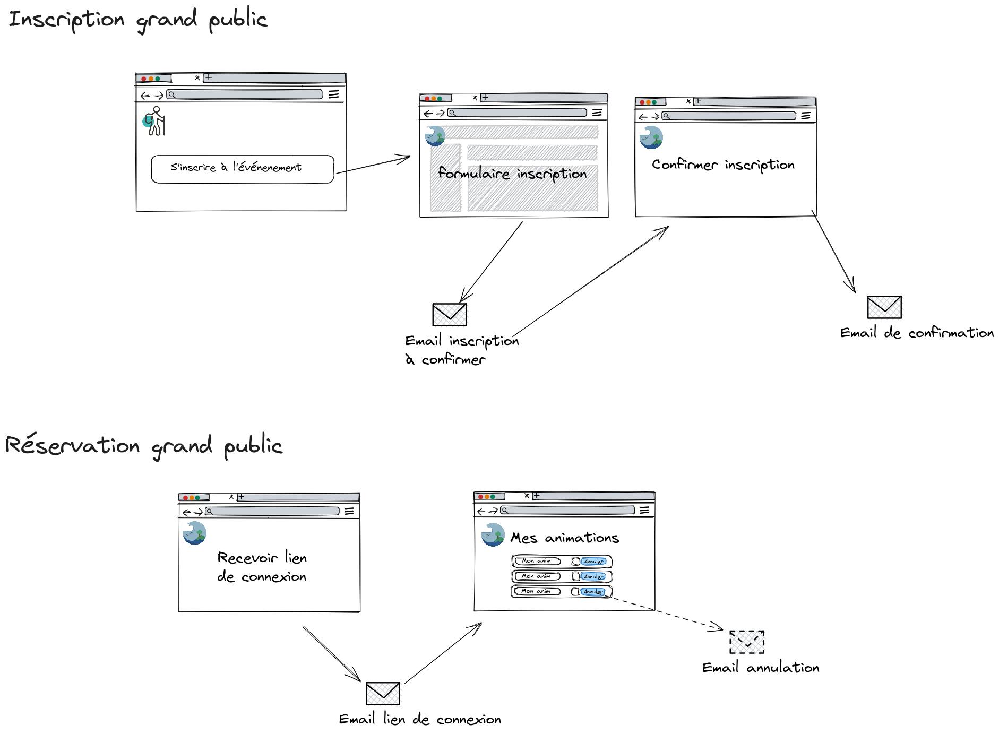
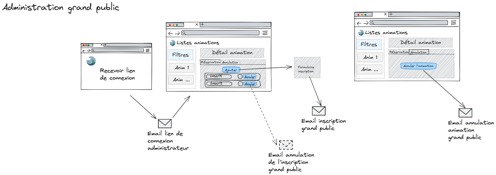
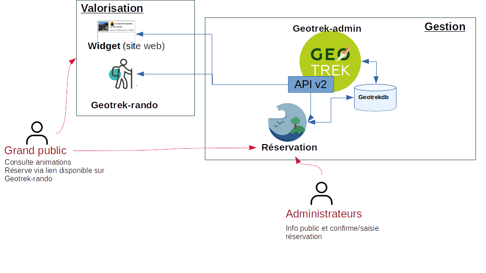

# Réservation des animations dans Geotrek

Application permettant la gestion des réservations des animations publiées sur Geotrek.
Elle permet aux visiteurs d'un portail Geotrek Rando de réserver des places pour les
événements.
Une interface d'administration est disponible pour gérer les réservations.

La gestion de l'authentification est sans mot de passe et fonctionne avec des liens envoyés par email.

## Interface grand public
**Fonctionnalités principales**
 * S'inscrire à une animation
 * Confirmer son inscription
 * Annuler son inscription
 * Visualiser ses inscriptions

**Schéma simplifié du fonctionnement pour le grand public**

## Interface administrateur
**Fonctionnalités principales**
 * Voir la liste des animations
 * Gérer les inscriptions (visualisation/ajout/modification/annulation/export)
 * Envoyer un email d'annulation en cas d'annulation de l'animation
 * Exporter des bilans

**Schéma simplifié du fonctionnement pour les administrateurs**

# Installation et configuration
L'application n'est pas indépendante, elle repose sur la gestion des événements dans geotrek-admin et partage la même base de données.

Elle est composée de deux éléments :
 * Fichier permettant d'ajouter le lien de réservation dans Geotrek-rando (non obligatoire)
 * Application à proprement parler

**Schéma général de l'architecture**

## Déploiement

Les instructions se trouvent à `docs/deploiement.md` et dans les READMEs `backend/README.md` et `front-vite/README.md`.

## Configuration

 * `backend/config/config.py`
 * `front-vite/.env`
 * `front-vite/public/config/config.js`
 * `front-vite/public/css/custom.css`
 * `front-vite/public/page_accueil.md`
 * `front-vite/public/page_info_admin.md`
 * `front-vite/public/page_reservation.md`