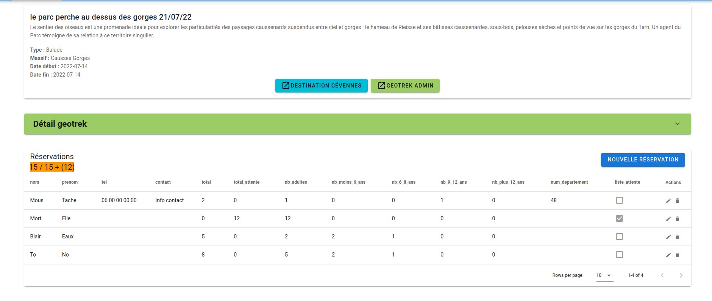

# Reservation des animations dans geotrek

Petite application permettant de gérer les reservations des événement saisies dans Geotrek via une interface d'admistration.
La gestion des utilisateurs est effectuée via un lien vers usershub


## Liste


## Détail



# Installation et configuration
## Configuration

 * `backend/config/config.py`
 * `frontend/src/config/config.js`
 * `frontend/src/views/Informations.vue`

## Base de données

## Applications

```
 ./install.sh
```

## Déploiement

Un `docker-compose.yml` est présent pour instancier :
* un build du backend Flask
* un mailhog pour l'instance d'envoi d'email faké
* un nginx pour exposer le build du front

Cette partie doit encore être améliorée car, à ce jour, 
cela fonctionne pour la démo, avec un build front généré à la main
et disposé "au bon endroit" pour nginx (cf le binding de volume).

Le `docker-compose.yml` est positionné dans le répertoire supérieur
sur notre vm de test, pour pouvoir disposer d'une configuration nginx, 
du build front, et du repo png-resa.

Un template de la configuration Nginx utilisée se trouve dans le 
répertoire `install`.

## Lien de réservation dans Geotrek Rando

Il faut ajouter le script `install/scriptsFooter.html` dans la customization de Geotrek Rando.
L'emplacement est `<geotrek-rando>/customization/html/scriptsFooter.html`.


# Technologie
* backend : python flask
* frontend : Vue 3 + TypeScript + Vite + Tailwind CSS [ + Vuetify ]